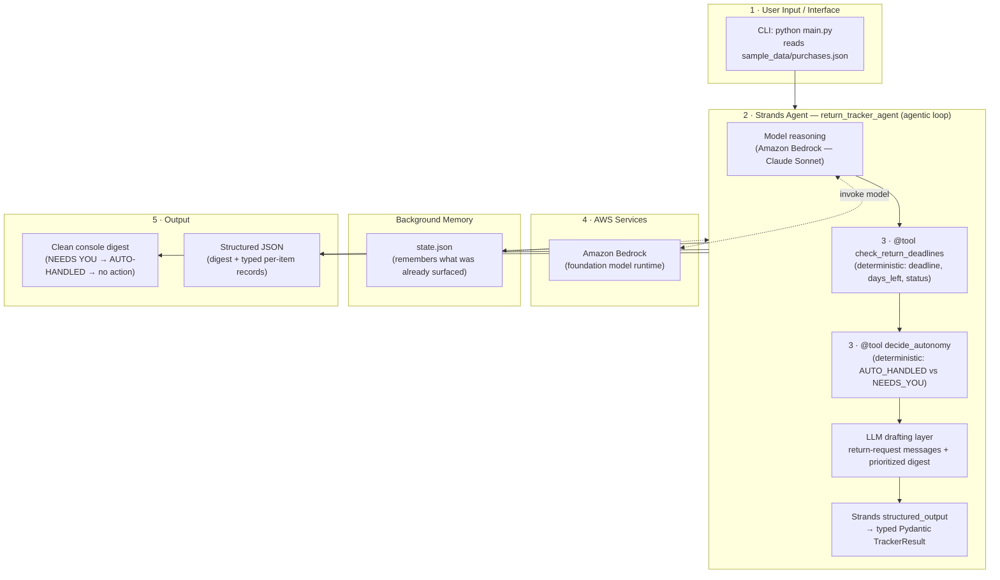

# Architecture

Return Window Tracker is a single **Strands Agents SDK** agent
(`return_tracker_agent`) with **two deterministic custom tools**, an LLM drafting
layer, background memory, and typed structured output.

The diagram below maps to the five elements judges look for: **user
input/interface**, **Strands agent + agentic loop**, **tools & integrations**,
**AWS services**, and **output**.

## Flow explained

The user runs the CLI, which loads their purchases and hands them to the Strands
`return_tracker_agent`. The agent's system prompt requires it to first call the
deterministic `check_return_deadlines` tool (all date math and status
classification) and then `decide_autonomy` (the deterministic escalation policy
that decides what the agent can safely auto-handle versus what a human must
weigh in on) — so every number and every escalation decision is auditable Python,
never LLM guesswork. The agent (running on **Amazon Bedrock**) then uses the LLM
only for drafting the natural-language return-request messages and the
human-readable digest, and Strands **structured output** coerces the final answer
into a typed `TrackerResult`. A small `state.json` gives the agent background
memory across runs, so it behaves like a quiet background service that only
re-surfaces what is genuinely new or newly urgent, and the CLI prints both a
clean console digest and machine-readable JSON.

## Why split deterministic tools vs. LLM?

- **`check_return_deadlines`** owns correctness-critical math: deadlines,
  days-left, and status. Testable and reproducible.
- **`decide_autonomy`** owns the escalation policy: whether to act autonomously
  or surface for a human. Predictable and auditable — the core "Everyday Agent"
  behavior of *"make the safe calls on its own, only ping a human when it
  matters."*
- **LLM layer** owns natural language: polite, contextual return-request messages
  and a readable digest, always reusing the tools' exact numbers.
- **Structured output** guarantees the machine-readable result is well-typed
  rather than fragile hand-written JSON.
